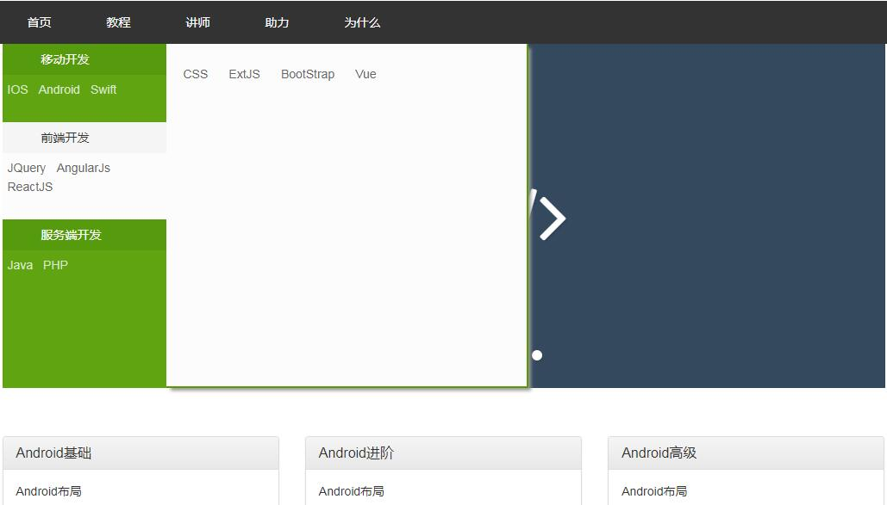

## cofuture是一个专业的完全免费的网络教学站，包括所有流行的基础语言 如：php, java, js,swift,kotlin等....
###基础功能已经完成， 
*后台实现了课程的CRUD, 课程分类的CRUD 
*前端实现了首页展示、分类展示、查看课程详情 

##后台管理界面展示
【后台-首页】 

【后台-分类管理】 

【后台-添加/修改教程】 

【后台-添加/修改分类】 

##前台界面展示
【前台-首页】 

【前台-首页2】 

【前台-课程分类-类型列表】 

【前台-课程详情】 

##未完成细节： 
1. 后台管理需要登录
2. 前端添加用户模块
3. 用户查看数和点赞数操作
4. 《为什么》模块
5. 《讲师》模块
6. 《助力或会员》模块

.....
望 有志同道合者共同完成。。

